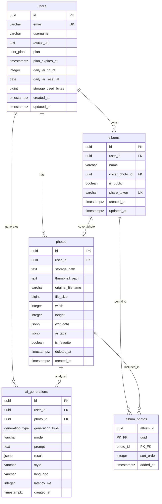

# ER図・データベース設計書

## 1. ER図



## 2. ENUM型定義

### `user_plan`

ユーザーのサブスクリプションプランを表すENUM型。

| 値 | 説明 |
|---|---|
| `free` | 無料プラン |
| `premium` | プレミアムプラン |

定義元: `001_create_users.sql`

```sql
CREATE TYPE user_plan AS ENUM ('free', 'premium');
```

### `generation_type`

AI生成の種類を表すENUM型。

| 値 | 説明 |
|---|---|
| `hashtag` | ハッシュタグ生成 |
| `caption` | キャプション生成 |

定義元: `004_create_ai_generations.sql`

```sql
CREATE TYPE generation_type AS ENUM ('hashtag', 'caption');
```

## 3. テーブル定義

### 3.1 `users` テーブル

ユーザープロフィール情報を管理するテーブル。`auth.users` テーブルと1対1で紐づく。

| カラム名 | データ型 | NULL | デフォルト | 制約 | 説明 |
|---|---|---|---|---|---|
| `id` | UUID | NOT NULL | - | PRIMARY KEY, REFERENCES auth.users(id) ON DELETE CASCADE | ユーザーID（Supabase Auth連携） |
| `email` | VARCHAR(255) | NOT NULL | - | UNIQUE | メールアドレス |
| `username` | VARCHAR(100) | NULL | - | - | ユーザー名 |
| `avatar_url` | TEXT | NULL | - | - | アバター画像URL |
| `plan` | user_plan | NOT NULL | `'free'` | - | サブスクリプションプラン |
| `plan_expires_at` | TIMESTAMPTZ | NULL | - | - | プラン有効期限 |
| `daily_ai_count` | INTEGER | NOT NULL | `0` | - | 当日のAI生成回数 |
| `daily_ai_reset_at` | DATE | NOT NULL | `CURRENT_DATE` | - | AI回数リセット日 |
| `storage_used_bytes` | BIGINT | NOT NULL | `0` | - | 使用ストレージ容量（バイト） |
| `created_at` | TIMESTAMPTZ | NOT NULL | `NOW()` | - | 作成日時 |
| `updated_at` | TIMESTAMPTZ | NOT NULL | `NOW()` | - | 更新日時（トリガーで自動更新） |

### 3.2 `photos` テーブル

ユーザーがアップロードした写真のメタデータを管理するテーブル。

| カラム名 | データ型 | NULL | デフォルト | 制約 | 説明 |
|---|---|---|---|---|---|
| `id` | UUID | NOT NULL | `gen_random_uuid()` | PRIMARY KEY | 写真ID |
| `user_id` | UUID | NOT NULL | - | REFERENCES users(id) ON DELETE CASCADE | 所有ユーザーID |
| `storage_path` | TEXT | NOT NULL | - | - | Storageバケット内のファイルパス |
| `thumbnail_path` | TEXT | NULL | - | - | サムネイル画像のパス |
| `original_filename` | VARCHAR(500) | NULL | - | - | アップロード時のファイル名 |
| `file_size` | BIGINT | NULL | - | - | ファイルサイズ（バイト） |
| `width` | INTEGER | NULL | - | - | 画像の幅（ピクセル） |
| `height` | INTEGER | NULL | - | - | 画像の高さ（ピクセル） |
| `exif_data` | JSONB | NULL | `'{}'` | - | EXIF情報（JSON形式） |
| `ai_tags` | JSONB | NULL | `'[]'` | - | AIが生成したタグ（JSON配列） |
| `is_favorite` | BOOLEAN | NOT NULL | `FALSE` | - | お気に入りフラグ |
| `deleted_at` | TIMESTAMPTZ | NULL | - | - | 論理削除日時（ソフトデリート） |
| `created_at` | TIMESTAMPTZ | NOT NULL | `NOW()` | - | 作成日時 |

### 3.3 `albums` テーブル

アルバム情報を管理するテーブル。

| カラム名 | データ型 | NULL | デフォルト | 制約 | 説明 |
|---|---|---|---|---|---|
| `id` | UUID | NOT NULL | `gen_random_uuid()` | PRIMARY KEY | アルバムID |
| `user_id` | UUID | NOT NULL | - | REFERENCES users(id) ON DELETE CASCADE | 所有ユーザーID |
| `name` | VARCHAR(200) | NOT NULL | - | - | アルバム名 |
| `cover_photo_id` | UUID | NULL | - | REFERENCES photos(id) ON DELETE SET NULL | カバー写真ID |
| `is_public` | BOOLEAN | NOT NULL | `FALSE` | - | 公開フラグ |
| `share_token` | VARCHAR(64) | NULL | - | UNIQUE | 共有用トークン |
| `created_at` | TIMESTAMPTZ | NOT NULL | `NOW()` | - | 作成日時 |
| `updated_at` | TIMESTAMPTZ | NOT NULL | `NOW()` | - | 更新日時（トリガーで自動更新） |

### 3.4 `album_photos` テーブル（中間テーブル）

アルバムと写真の多対多リレーションを管理する中間テーブル。

| カラム名 | データ型 | NULL | デフォルト | 制約 | 説明 |
|---|---|---|---|---|---|
| `album_id` | UUID | NOT NULL | - | PRIMARY KEY (複合), REFERENCES albums(id) ON DELETE CASCADE | アルバムID |
| `photo_id` | UUID | NOT NULL | - | PRIMARY KEY (複合), REFERENCES photos(id) ON DELETE CASCADE | 写真ID |
| `sort_order` | INTEGER | NOT NULL | `0` | - | アルバム内の表示順序 |
| `added_at` | TIMESTAMPTZ | NOT NULL | `NOW()` | - | アルバムへの追加日時 |

### 3.5 `ai_generations` テーブル

AI生成の履歴を記録するテーブル。

| カラム名 | データ型 | NULL | デフォルト | 制約 | 説明 |
|---|---|---|---|---|---|
| `id` | UUID | NOT NULL | `gen_random_uuid()` | PRIMARY KEY | 生成ID |
| `user_id` | UUID | NOT NULL | - | REFERENCES users(id) ON DELETE CASCADE | ユーザーID |
| `photo_id` | UUID | NOT NULL | - | REFERENCES photos(id) ON DELETE CASCADE | 対象写真ID |
| `generation_type` | generation_type | NOT NULL | - | - | 生成タイプ（hashtag / caption） |
| `model` | VARCHAR(100) | NOT NULL | `'gemini-3-flash-preview'` | - | 使用AIモデル名 |
| `prompt` | TEXT | NULL | - | - | 使用したプロンプト |
| `result` | JSONB | NOT NULL | `'{}'` | - | 生成結果（JSON形式） |
| `style` | VARCHAR(50) | NULL | - | - | キャプションのスタイル |
| `language` | VARCHAR(10) | NOT NULL | `'ja'` | - | 出力言語 |
| `latency_ms` | INTEGER | NULL | - | - | API応答時間（ミリ秒） |
| `created_at` | TIMESTAMPTZ | NOT NULL | `NOW()` | - | 生成日時 |

## 4. リレーション

### 4.1 users → photos（1対多）

- **外部キー**: `photos.user_id` → `users.id`
- **削除時動作**: `ON DELETE CASCADE`（ユーザー削除時に全写真を削除）
- **説明**: 1人のユーザーは複数の写真を所有できる

### 4.2 users → albums（1対多）

- **外部キー**: `albums.user_id` → `users.id`
- **削除時動作**: `ON DELETE CASCADE`（ユーザー削除時に全アルバムを削除）
- **説明**: 1人のユーザーは複数のアルバムを作成できる

### 4.3 albums → photos（多対1 / カバー写真）

- **外部キー**: `albums.cover_photo_id` → `photos.id`
- **削除時動作**: `ON DELETE SET NULL`（カバー写真削除時にNULLに設定）
- **説明**: 各アルバムは1枚のカバー写真を持てる（任意）

### 4.4 albums ↔ photos（多対多）

- **中間テーブル**: `album_photos`
- **外部キー**:
  - `album_photos.album_id` → `albums.id`（ON DELETE CASCADE）
  - `album_photos.photo_id` → `photos.id`（ON DELETE CASCADE）
- **複合主キー**: `(album_id, photo_id)`
- **説明**: 1つのアルバムに複数の写真を含められ、1枚の写真は複数のアルバムに所属できる

### 4.5 users → ai_generations（1対多）

- **外部キー**: `ai_generations.user_id` → `users.id`
- **削除時動作**: `ON DELETE CASCADE`（ユーザー削除時に全生成履歴を削除）
- **説明**: 1人のユーザーは複数のAI生成を実行できる

### 4.6 photos → ai_generations（1対多）

- **外部キー**: `ai_generations.photo_id` → `photos.id`
- **削除時動作**: `ON DELETE CASCADE`（写真削除時に関連する生成履歴を削除）
- **説明**: 1枚の写真に対して複数のAI生成を実行できる

## 5. インデックス一覧

| テーブル | インデックス名 | カラム | 種類 | 条件 |
|---|---|---|---|---|
| `users` | `idx_users_email` | `email` | B-tree | - |
| `photos` | `idx_photos_user_id` | `user_id` | B-tree | - |
| `photos` | `idx_photos_created_at` | `created_at DESC` | B-tree | - |
| `photos` | `idx_photos_is_favorite` | `user_id, is_favorite` | B-tree (Partial) | `WHERE is_favorite = TRUE` |
| `photos` | `idx_photos_ai_tags` | `ai_tags` | GIN | - |
| `photos` | `idx_photos_deleted_at` | `deleted_at` | B-tree (Partial) | `WHERE deleted_at IS NOT NULL` |
| `albums` | `idx_albums_user_id` | `user_id` | B-tree | - |
| `albums` | `idx_albums_share_token` | `share_token` | B-tree (Partial) | `WHERE share_token IS NOT NULL` |
| `album_photos` | `idx_album_photos_album_id` | `album_id` | B-tree | - |
| `album_photos` | `idx_album_photos_photo_id` | `photo_id` | B-tree | - |
| `ai_generations` | `idx_ai_generations_user_id` | `user_id` | B-tree | - |
| `ai_generations` | `idx_ai_generations_photo_id` | `photo_id` | B-tree | - |
| `ai_generations` | `idx_ai_generations_created_at` | `created_at DESC` | B-tree | - |

### インデックス設計の補足

- **Partialインデックス**: `idx_photos_is_favorite` と `idx_photos_deleted_at` と `idx_albums_share_token` は条件付きインデックスを使用し、該当するレコードのみをインデックスに含めることでインデックスサイズを削減している
- **GINインデックス**: `idx_photos_ai_tags` はJSONB型のai_tagsカラムに対するGIN（Generalized Inverted Index）インデックスで、JSONBデータ内のキーや値の検索を高速化する
- **降順インデックス**: `idx_photos_created_at` と `idx_ai_generations_created_at` は `DESC` 指定により、最新レコードの取得を高速化している

## 6. RLSポリシー一覧

### 6.1 `users` テーブル

| ポリシー名 | 操作 | 条件 |
|---|---|---|
| Users can view own profile | SELECT | `auth.uid() = id` |
| Users can update own profile | UPDATE | USING: `auth.uid() = id`, WITH CHECK: `auth.uid() = id` |

### 6.2 `photos` テーブル

| ポリシー名 | 操作 | 条件 |
|---|---|---|
| Users can view own photos | SELECT | `auth.uid() = user_id AND deleted_at IS NULL` |
| Users can view own deleted photos | SELECT | `auth.uid() = user_id AND deleted_at IS NOT NULL` |
| Users can insert own photos | INSERT | WITH CHECK: `auth.uid() = user_id` |
| Users can update own photos | UPDATE | USING: `auth.uid() = user_id`, WITH CHECK: `auth.uid() = user_id` |
| Users can delete own photos | DELETE | `auth.uid() = user_id` |

### 6.3 `albums` テーブル

| ポリシー名 | 操作 | 条件 |
|---|---|---|
| Users can view own albums | SELECT | `auth.uid() = user_id` |
| Anyone can view public albums by share token | SELECT | `is_public = TRUE AND share_token IS NOT NULL` |
| Users can insert own albums | INSERT | WITH CHECK: `auth.uid() = user_id` |
| Users can update own albums | UPDATE | USING: `auth.uid() = user_id`, WITH CHECK: `auth.uid() = user_id` |
| Users can delete own albums | DELETE | `auth.uid() = user_id` |

### 6.4 `album_photos` テーブル

| ポリシー名 | 操作 | 条件 |
|---|---|---|
| Users can view own album photos | SELECT | `EXISTS (SELECT 1 FROM albums WHERE albums.id = album_photos.album_id AND albums.user_id = auth.uid())` |
| Users can view public album photos | SELECT | `EXISTS (SELECT 1 FROM albums WHERE albums.id = album_photos.album_id AND albums.is_public = TRUE)` |
| Users can manage own album photos | INSERT | WITH CHECK: `EXISTS (SELECT 1 FROM albums WHERE albums.id = album_photos.album_id AND albums.user_id = auth.uid())` |
| Users can delete own album photos | DELETE | `EXISTS (SELECT 1 FROM albums WHERE albums.id = album_photos.album_id AND albums.user_id = auth.uid())` |

### 6.5 `ai_generations` テーブル

| ポリシー名 | 操作 | 条件 |
|---|---|---|
| Users can view own generations | SELECT | `auth.uid() = user_id` |
| Users can insert own generations | INSERT | WITH CHECK: `auth.uid() = user_id` |

### 6.6 `storage.objects`（Storageバケット）

| ポリシー名 | 操作 | 条件 |
|---|---|---|
| Users can upload own photos | INSERT | WITH CHECK: `bucket_id = 'photos' AND auth.uid()::text = (storage.foldername(name))[1]` |
| Users can view own photos | SELECT | `bucket_id = 'photos' AND auth.uid()::text = (storage.foldername(name))[1]` |
| Users can delete own photos | DELETE | `bucket_id = 'photos' AND auth.uid()::text = (storage.foldername(name))[1]` |

## 7. トリガー

### 7.1 `update_updated_at_column()` 関数

`updated_at` カラムを自動更新するためのトリガー関数。

```sql
CREATE OR REPLACE FUNCTION update_updated_at_column()
RETURNS TRIGGER AS $$
BEGIN
    NEW.updated_at = NOW();
    RETURN NEW;
END;
$$ language 'plpgsql';
```

**適用テーブル:**

| テーブル | トリガー名 | タイミング | イベント |
|---|---|---|---|
| `users` | `update_users_updated_at` | BEFORE UPDATE | FOR EACH ROW |
| `albums` | `update_albums_updated_at` | BEFORE UPDATE | FOR EACH ROW |

### 7.2 `handle_new_user()` 関数

Supabase Authでユーザーが新規登録された際に、自動的に `public.users` テーブルにプロフィールレコードを作成するトリガー関数。

```sql
CREATE OR REPLACE FUNCTION handle_new_user()
RETURNS TRIGGER AS $$
BEGIN
    INSERT INTO public.users (id, email, username)
    VALUES (
        NEW.id,
        NEW.email,
        COALESCE(NEW.raw_user_meta_data->>'username', split_part(NEW.email, '@', 1))
    );
    RETURN NEW;
END;
$$ language 'plpgsql' SECURITY DEFINER;
```

**適用テーブル:**

| テーブル | トリガー名 | タイミング | イベント |
|---|---|---|---|
| `auth.users` | `on_auth_user_created` | AFTER INSERT | FOR EACH ROW |

**動作説明:**
- `auth.users` に新規レコードが挿入されると自動実行される
- `username` はユーザーメタデータの `username` フィールドを優先し、なければメールアドレスの `@` 前の部分を使用する
- `SECURITY DEFINER` により、関数作成者の権限で実行される（RLSをバイパスするために必要）

## 8. Storageバケット設定

### 8.1 バケット定義

| 項目 | 値 |
|---|---|
| バケットID | `photos` |
| バケット名 | `photos` |
| 公開設定 | `FALSE`（プライベート） |
| ファイルサイズ上限 | 10MB（10,485,760 バイト） |
| 許可MIMEタイプ | `image/jpeg`, `image/png`, `image/webp`, `image/heic` |

### 8.2 フォルダ構造

```
photos/
  └── {user_id}/
      └── photos/
          └── {filename}
```

各ユーザーのファイルはユーザーIDで分離されたフォルダに格納される。`storage.foldername(name)` 関数によってパスの先頭フォルダ名（= ユーザーID）が取得され、RLSポリシーでアクセス制御に使用される。

### 8.3 Storageポリシー

| ポリシー名 | 操作 | 条件 | 説明 |
|---|---|---|---|
| Users can upload own photos | INSERT | `bucket_id = 'photos' AND auth.uid()::text = (storage.foldername(name))[1]` | 自分のフォルダにのみアップロード可能 |
| Users can view own photos | SELECT | `bucket_id = 'photos' AND auth.uid()::text = (storage.foldername(name))[1]` | 自分のフォルダ内のファイルのみ閲覧可能 |
| Users can delete own photos | DELETE | `bucket_id = 'photos' AND auth.uid()::text = (storage.foldername(name))[1]` | 自分のフォルダ内のファイルのみ削除可能 |

全てのポリシーにおいて、ストレージパスの先頭フォルダ名が認証済みユーザーのUUIDと一致することを検証することで、ユーザー間のデータアクセスを防止している。
