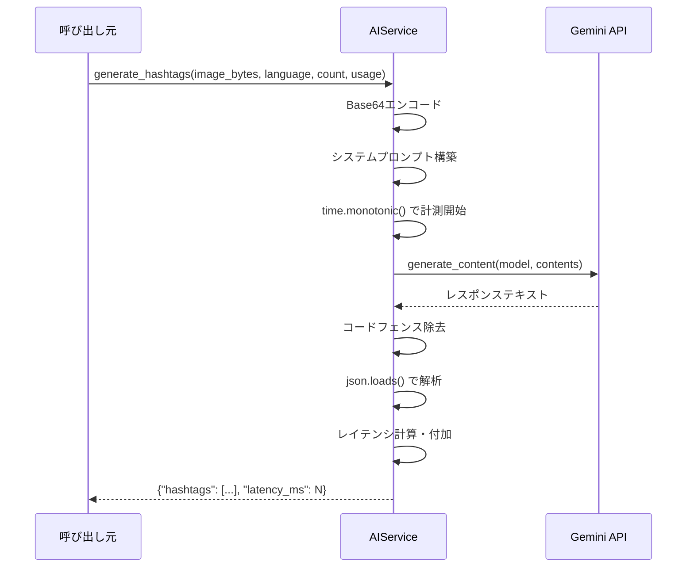

# AIプロンプト設計書

## 1. 概要

| 項目 | 値 |
|---|---|
| 使用モデル | Google Gemini 2.0 Flash (`gemini-2.0-flash`) |
| SDKライブラリ | `google-genai` Python SDK |
| クライアント初期化 | `genai.Client(api_key=api_key)` |
| 入力 | Base64エンコードされた画像 (JPEG) |
| 出力 | JSON形式のテキスト |

ソースファイル: `backend/services/ai_service.py`

## 2. ハッシュタグ生成

### 2.1 システムプロンプト

`generate_hashtags` メソッドで使用されるシステムプロンプト:

```
あなたはSNSマーケティングの専門家です。与えられた写真を分析し、
エンゲージメントを最大化するハッシュタグを{count}個生成してください。

対象プラットフォーム: {usage}
言語: {language}

JSON形式で返してください: {"hashtags": ["#tag1", "#tag2", ...]}
JSONのみを返し、他のテキストは含めないでください。
```

**パラメータプレースホルダ:**
- `{count}` -- 生成するハッシュタグの数（デフォルト: 15）
- `{usage}` -- 対象SNSプラットフォーム（デフォルト: "instagram"）
- `{language}` -- 出力言語（デフォルト: "ja"）

### 2.2 パラメータ

| パラメータ | 型 | デフォルト | 説明 |
|---|---|---|---|
| `image_bytes` | `bytes` | (必須) | 画像のバイト列データ |
| `language` | `str` | `"ja"` | 出力言語（日本語/英語など） |
| `count` | `int` | `15` | 生成するハッシュタグ数 |
| `usage` | `str` | `"instagram"` | 対象プラットフォーム（instagram, twitter等） |

### 2.3 入力形式

- 画像バイト列を `base64.standard_b64encode()` でBase64エンコード
- `inline_data` として以下の形式で送信:

```python
{
    "role": "user",
    "parts": [
        {"inline_data": {"mime_type": "image/jpeg", "data": b64}},
        {"text": system_prompt},
    ],
}
```

- **MIME type**: `image/jpeg`

### 2.4 出力形式

```json
{
    "hashtags": ["#tag1", "#tag2", "..."],
    "latency_ms": 1234
}
```

- `hashtags`: `#` 付きのハッシュタグ文字列の配列
- `latency_ms`: API呼び出しにかかった時間（ミリ秒、レスポンス処理後に付加）

### 2.5 プロンプトの設計意図

- **SNSマーケティング専門家のペルソナを設定**: 「あなたはSNSマーケティングの専門家です」という冒頭で、AIに専門的な知識を持つペルソナを与え、質の高いハッシュタグ生成を促す
- **エンゲージメント最大化を目的として指示**: 単なるタグ付けではなく、SNS上でのリーチ・エンゲージメントを意識したタグ選定を指示している
- **出力をJSON形式に限定**: 「JSONのみを返し、他のテキストは含めないでください」により、プログラムで処理可能な構造化データのみを出力させ、テキスト混入を防止する
- **プラットフォームと言語を指定可能**: `usage` と `language` パラメータにより、プラットフォーム固有のトレンドや言語圏に最適化されたハッシュタグを生成できる

## 3. キャプション生成

### 3.1 通常モード システムプロンプト

`custom_prompt` が `None` の場合に使用されるシステムプロンプト:

```
あなたはSNSコンテンツクリエイターです。与えられた写真に合う{style}スタイルの投稿文を生成してください。

スタイル: {style}
言語: {language}
文字数目安: {char_guide}

JSON形式で返してください: {"caption": "生成されたテキスト"}
JSONのみを返し、他のテキストは含めないでください。
```

**パラメータプレースホルダ:**
- `{style}` -- キャプションのスタイル（デフォルト: "casual"）
- `{language}` -- 出力言語（デフォルト: "ja"）
- `{char_guide}` -- 文字数ガイド（length パラメータから変換、例: "約300文字"）

### 3.2 カスタムモード システムプロンプト

`custom_prompt` が指定された場合に使用されるシステムプロンプト:

```
あなたはSNSコンテンツクリエイターです。以下の指示に従って投稿文を生成してください。

指示: {custom_prompt}
言語: {language}
文字数目安: {char_guide}

JSON形式で返してください: {"caption": "生成されたテキスト"}
JSONのみを返し、他のテキストは含めないでください。
```

**パラメータプレースホルダ:**
- `{custom_prompt}` -- ユーザーが指定したカスタム指示文
- `{language}` -- 出力言語（デフォルト: "ja"）
- `{char_guide}` -- 文字数ガイド（length パラメータから変換）

**通常モードとの違い:**
- 通常モードでは `style` パラメータによってプリセットされたスタイルを適用する
- カスタムモードでは `style` の代わりにユーザーの自由記述（`custom_prompt`）を指示として使用する

### 3.3 パラメータ

| パラメータ | 型 | デフォルト | 説明 |
|---|---|---|---|
| `image_bytes` | `bytes` | (必須) | 画像のバイト列データ |
| `language` | `str` | `"ja"` | 出力言語 |
| `style` | `str` | `"casual"` | キャプションのスタイル（casual, poem, business, news, humor） |
| `length` | `str` | `"medium"` | 出力文字数の長さ指定（short, medium, long） |
| `custom_prompt` | `str \| None` | `None` | カスタムプロンプト（指定時はスタイル指定を上書き） |

**スタイル一覧:**

| スタイル | 説明 |
|---|---|
| `casual` | カジュアルな日常投稿風 |
| `poem` | 詩的・文学的な表現 |
| `business` | ビジネス・フォーマルな表現 |
| `news` | ニュース記事風の客観的な表現 |
| `humor` | ユーモア・面白みのある表現 |

### 3.4 文字数ガイド

| `length` | 目安文字数 | 用途 |
|---|---|---|
| `short` | 約100文字 | 短いコメントや一言投稿 |
| `medium` | 約300文字 | 標準的なSNS投稿 |
| `long` | 約800文字 | 詳細な説明やブログ風投稿 |

指定された `length` が上記のいずれにも該当しない場合、デフォルトとして「約300文字」が使用される。

### 3.5 出力形式

```json
{
    "caption": "生成されたテキスト",
    "latency_ms": 1234
}
```

- `caption`: 生成されたキャプション文字列
- `latency_ms`: API呼び出しにかかった時間（ミリ秒、レスポンス処理後に付加）

## 4. レスポンス処理

### 4.1 マークダウンコードフェンス除去

Gemini APIのレスポンスにはマークダウンのコードフェンス（` ``` `）が含まれる場合がある。以下のロジックで除去を行う。

```python
text = response.text.strip()
# Strip markdown code fences if present
if text.startswith("```"):
    text = text.split("\n", 1)[1] if "\n" in text else text[3:]
    if text.endswith("```"):
        text = text[:-3].strip()
```

**処理フロー:**

1. レスポンステキストの前後の空白を除去（`strip()`）
2. テキストが ` ``` ` で始まるかチェック
3. 始まっている場合:
   - 改行が含まれていれば、最初の行（` ```json` 等）を除去
   - 改行が含まれていなければ、先頭3文字（` ``` `）を除去
4. テキストの末尾が ` ``` ` で終わっていれば除去し、前後の空白を再除去

**対応例:**

入力:
````
```json
{"hashtags": ["#photo", "#sunset"]}
```
````

出力:
```
{"hashtags": ["#photo", "#sunset"]}
```

### 4.2 JSON解析

- `json.loads()` を使用してテキストをPython辞書に変換
- `json.JSONDecodeError` が発生した場合:
  - エラーログを出力（元のレスポンステキストを含む）
  - `ValueError` を送出し、わかりやすいエラーメッセージを付与
    - ハッシュタグ: `"AI returned invalid JSON for hashtags"`
    - キャプション: `"AI returned invalid JSON for caption"`

### 4.3 レイテンシ計測

```python
start_ms = time.monotonic()
# ... API呼び出し ...
elapsed_ms = int((time.monotonic() - start_ms) * 1000)
result["latency_ms"] = elapsed_ms
```

- `time.monotonic()` でAPI呼び出し開始前の時刻を記録（単調増加クロックを使用し、システム時刻変更の影響を受けない）
- レスポンス受信・JSON解析後に経過時間を計算
- ミリ秒単位に変換（`* 1000`）し、整数に切り捨て（`int()`）
- 結果辞書に `latency_ms` キーとして追加

## 5. エラーハンドリング

### 5.1 エラー種別と対応

| エラー種別 | 例外クラス | 対応 | ログ出力 |
|---|---|---|---|
| JSON解析エラー | `json.JSONDecodeError` | `ValueError` を送出（説明メッセージ付き） | `logger.error` でレスポンステキストを記録 |
| Gemini APIエラー | `Exception`（汎用） | 例外をそのまま再送出（`raise`） | `logger.error` でエラー内容を記録 |

### 5.2 エラーハンドリングの実装パターン

```python
try:
    # Base64エンコード、API呼び出し、JSON解析
    ...
except json.JSONDecodeError:
    logger.error("Failed to parse Gemini hashtag response: %s", text)
    raise ValueError("AI returned invalid JSON for hashtags")
except Exception as e:
    logger.error("Gemini hashtag generation failed: %s", e)
    raise
```

**設計方針:**
- JSON解析エラーは `ValueError` に変換し、呼び出し元に対して明確なエラーメッセージを提供する
- Gemini APIの通信エラーやその他の例外はそのまま再送出し、上位レイヤーでのハンドリングに委ねる
- 全てのエラーは Python の `logging` モジュール（`logger.error`）を通じてログに記録される

## 6. API呼び出しフロー

```
1. 画像バイト列を受け取る (image_bytes: bytes)
         |
         v
2. Base64エンコード (base64.standard_b64encode)
         |
         v
3. システムプロンプト構築 (パラメータを埋め込み)
         |
         v
4. Gemini APIに送信 (client.models.generate_content)
   - model: "gemini-2.0-flash"
   - contents: [inline_data(画像) + text(プロンプト)]
         |
         v
5. レスポンステキストからコードフェンスを除去
   - "```json\n...\n```" → "..."
         |
         v
6. JSONとして解析 (json.loads)
         |
         v
7. レイテンシを計算して結果dictに追加
   - result["latency_ms"] = elapsed_ms
         |
         v
8. 結果を返却 (dict)
```

### シーケンス図


